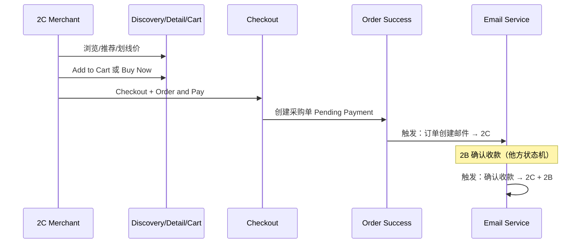

# Seller 2C — Product Sourcing V2 迭代规划

> **定位**：商家后台内 **2B 货源选品 / 采购** 模块（非独立商城）。  
> **基线**：`seller-2c-product-sourcing-prd-v1.0-final.md`（MVP v1.0）。  
> **本期范围（已确认）**：仅 **用户下单全流程**；**不包含** 采购订单列表/详情侧能力（由其他模块负责）。

---

## 〇、范围边界

### 本期负责（下单全流程）

```
Product Discovery → Product Detail → [Cart] → Checkout → Order & Pay → Order Success
         ↑________________ 推荐、划线价/折扣 Tag 贯穿选品与成功页 ________________↑
```

| 环节 | 页面/能力 |
|------|-----------|
| 选品 | Discovery 列表/搜索/Tab、推荐位、划线价 |
| 决策 | Product Detail、Buy Now、**Add to Cart** |
| 凑单 | **Cart**（多 SKU） |
| 结算 | Checkout（多行商品、Remark、Payment、Summary、Security Reminder） |
| 结果 | Order Success（Contact、推荐、下单成功话术） |
| 通知 | **邮件**（与下单链路相关的触发与模板；实现可在后端，PRD 由本流程定义触发点） |

### 本期不负责（其他模块 / 不展开 PRD）

| 功能 | 说明 |
|------|------|
| 再次购买（Buy Again） | PO Detail / List |
| 采购订单号搜索 | PO List |
| PO 导出 CSV | PO List |
| PO List/Detail 其他改造 | 铺货、物流、Cancel UI 等维持 V1 或他方迭代 |

**邮件说明**：「2B 确认收款后发邮件」属于 **订单状态变更触发**，本 PRD 只定义 **触发时机、收件人、模板内容**；发信实现可与交易中台/PO 模块联调，**不要求** 本期改 PO 页面。

---

## 一、V2 目标（下单全流程）

在 MVP 单笔立即购买基础上：

1. **转化**：推荐 + 划线价/折扣 Tag。  
2. **效率**：购物车多 SKU 一次结算。  
3. **协同**：下单成功、确认收款等节点邮件（2C + 2B/配置邮箱）。  
4. **不变**：固定达卡地址、无 Shipping Method、联络客服付款、不展示 2B 收款账户。

---

## 二、功能清单（本期 = 四项主轴 + 可选增强）

### 2.1 主轴（建议全部纳入本期）

| # | 功能 | 涉及页面 | 建议 |
|---|------|----------|------|
| V2-01 | **商品推荐** | Discovery、Detail、Success | **P0** |
| V2-02 | **购物车** | Detail、Cart（新）、Checkout | **P0** |
| V2-03 | **邮件通知** | 触发：创建订单、确认收款（+ 可选发货） | **P0** |
| V2-04 | **划线价 + 折扣 Tag** | Discovery、Detail、Cart 行 | **P0** |

**V2-01**：规则推荐即可 — 同店热销 / 同类目 / 本店最近采购（最近采购需登录）。  
**V2-02**：单 2B 货源；与 Buy Now 并存；数量在 **Cart 编辑** 还是 **Checkout 只读** 待确认（见 §八）。  
**V2-03**：首版建议 2～3 封 — ① 订单创建 → 2C ② 确认收款 → 2C + 2B ③（可选）发货 → 2C。  
**V2-04**：`originalPrice` + `salePrice`；无原价不展示划线。

### 2.2 可选增强（仍属下单前链路，复杂度低）

| # | 功能 | 说明 | 建议 |
|---|------|------|------|
| V2-07 | **最近浏览** | Discovery 横条 | P1 |
| V2-08 | **收藏夹** | Detail 收藏 SPU，Discovery「我的收藏」入口 | P1 |
| V2-11 | **类目筛选** | Discovery 侧栏/下拉 | P1 |
| V2-16 | **Remark 最近一条** | Checkout 记住上次备注 | P2 |

### 2.3 明确不做（本期）

- Buy Again、PO 搜索、PO CSV（他方模块）  
- 多 2B、阶梯价、购物车以外的 PO/铺货大改  
- 凭证上传（除非单独立项重开，且 Success 页由你负责时再议）

---

## 三、下单全流程 V2 时序（含邮件）



---

## 四、PRD v2.0 章节目录（仅下单全流程）

1. 文档信息与相对 v1.0 变更  
2. 范围：包含 / 不包含（PO 模块边界）  
3. 信息架构：Cart 入口、角标、路由  
4. **5.1** 选品浏览（推荐、划线价、Tab/搜索，沿用 V1）  
5. **5.2** 商品详情（Add to Cart、Buy Now、划线价、推荐位）  
6. **5.3** 购物车  
7. **5.4** Checkout（多 SKU、Remark、Payment、Summary、Security）  
8. **5.5** Order Success（话术、Contact、推荐、邮件已发送提示）  
9. **5.6** 邮件通知（触发、收件人、英文模板、与 PO 状态对齐说明）  
10. **5.7** 价格展示规则（原价/现价/折扣 Tag）  
11. 接口草案（Cart CRUD、合并下单、推荐、价格字段）  
12. 验收标准（AC）  
13. 附录：邮件模板、折扣计算公式  

**不包含章节**：PO List 搜索/导出/Buy Again、Publish to Store 细则（引用 V1）。

---

## 五、MVP → V2 差异（仅下单链路）

| 环节 | MVP v1.0 | V2 |
|------|----------|-----|
| 入口 | 仅 Buy Now | + Add to Cart + Cart 页 |
| Discovery/Detail | 采购价 | + 划线价、折扣 Tag、推荐 |
| Checkout | 单 SKU | 多 SKU 行、Grand Total 汇总 |
| Success | Contact + 文案 | + 推荐 + 邮件触发说明 |
| 邮件 | 无 | 创建单、确认收款（+ 可选发货） |
| PO 模块 | V1 | **本期不改**（他方） |

---

## 六、原型改页清单（本期）

| 文件 | 改动 |
|------|------|
| `index.html` | 推荐区；划线价+折扣；顶栏 Cart 角标 |
| `product-detail.html` | Add to Cart；划线价；推荐 |
| **`cart.html`（新）** | 列表、改数量、删行、Checkout |
| `checkout.html` | 多商品行；来自 Cart / Buy Now |
| `order-success.html` | 推荐；「Confirmation email sent」类文案 |
| 全局 `app.js` | Cart 本地状态或 mock API |
| ~~purchase-orders.html~~ | **本期不改** |
| ~~order-detail.html~~ | **本期不改** |

---

## 七、依赖与开放问题

| 依赖 | 说明 |
|------|------|
| 原价字段 | 商品中台 / 2B |
| 合并下单 | 一单多 SKU 行 vs 多单 — **需交易中台确认** |
| 邮件 | 2C 店主邮箱、2B 联系人配置来源 |

**开放问题（已定稿 2026/09/28）**

| # | 结论 |
|---|------|
| 1 | **数量**：Cart **与 Checkout** 均可修改。 |
| 2 | **合并下单**：**一个采购单、多 SKU 行**。 |
| 3 | **折扣 Tag**：**-X%**（如 -20%）。 |
| 4 | **推荐位**：**Product Detail** + **Order Success**（不做 Discovery 推荐）。 |

**待确认（可选 P1）**

- Buy Now 是否与 Cart 合并进入 Checkout（PRD v2.0 建议：Buy Now 仅单行，Cart 路径合并多行）。  
- V2-07/08/11 是否纳入本期。

---

## 八、下一步

确认 **§2.1 四项是否全部 P0** 及 **§八开放问题** 后，可生成：

- `seller-2c-product-sourcing-prd-v2.0.md`（仅下单全流程）  
- 原型：`cart.html` + 上述页面增量  

---

*文档版本：V2-planning-0.2 · 范围：下单全流程 only · 2026/09/28*
